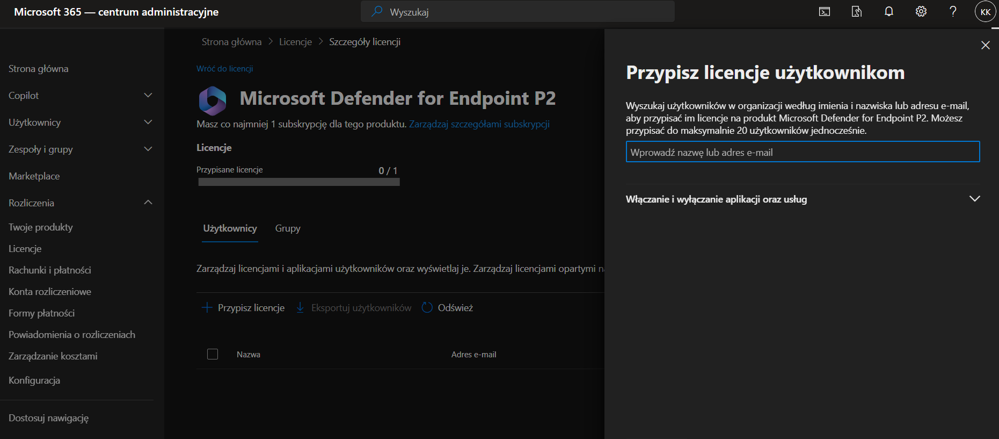
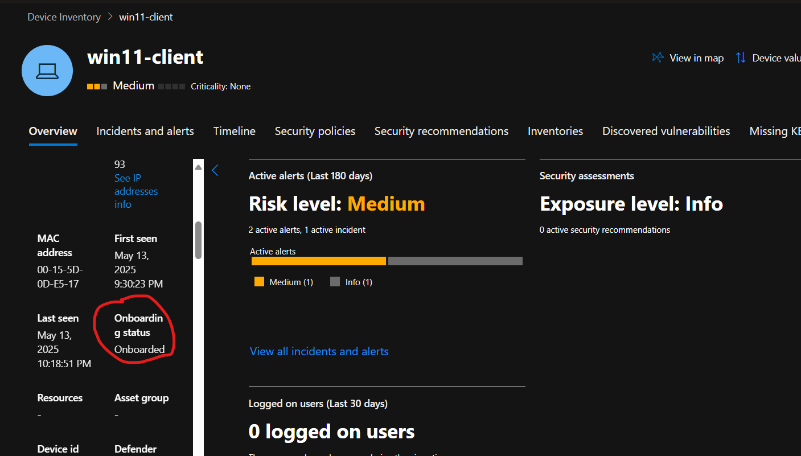

# Budowa LABa Microsoft Defender for Endpoint (licencja P2 z O365 Business Basic)

## Wstęp

Chcesz stworzyć własne środowisko do **Advanced Threat Hunting** i **Detection Engineering**? Ten poradnik poprowadzi Cię krok po kroku!

W ramach projektu stworzyłem własny tenant O365 oparty o licencje (Business Basic + Microsoft Defender for Endpoint P2). Oto szczegółowy opis łącznie z napotkanymi problemami i ich rozwiązaniem.

## Spis treści
- [Wstęp](#wstęp)
- [Etap 1: Rejestracja licencji O365 Business Basic](#etap-1-rejestracja-licencji-o365-business-basic)
- [Etap 2: Rejestracja adresu e-mail](#etap-2-rejestracja-adresu-e-mail)
- [Etap 3: Przydzielenie licencji](#etap-3-przydzielenie-licencji)
- [Etap 4: Oczekiwanie na propagację - cierpliwość to klucz](#etap-4-oczekiwanie-na-propagację---cierpliwość-to-klucz)
- [Etap 5: Konfiguracja w Security.microsoft.com](#etap-5-konfiguracja-w-securitymicrosoftcom)
- [Etap 6: Onboarding maszyny Windows 11](#etap-6-onboarding-maszyny-windows-11)
- [Etap 7: Pierwsze alerty i hunting](#etap-7-pierwsze-alerty-i-hunting)
- [Podsumowanie](#podsumowanie)
- [Co dalej?](#co-dalej)

# Etap 1: Rejestracja licencji O365 Business Basic

- 
- Wybranie wersji "Wypróbuj bezpłatnie przez miesiąc".

Napotkany problem: komunikat o przeciążonych serwerach (wyświetlany w nieskończoność)
Rejestracja powiodła się dopiero po przejściu do **trybu incognito** w przeglądarce!

- 

# Etap 2: Rejestracja adresu e-mail

- 
- 

Podanie służbowego adresu e-mail i konfiguracja konta organizacyjnego.

# Etap 3: Przydzielenie licencji

- 
- 

Przypisałem sobie licencję **Defender for Endpoint P2**.

# Etap 4: Oczekiwanie na propagację - cierpliwość to klucz

- 
- 

Pełna aktywacja usług w portalu **security.microsoft.com** trwała ok. **10-12 godzin**.  
Po drodze pojawiały się błędy jak AxiosError 400 i komunikaty o przygotowywaniu danych.

# Etap 5: Konfiguracja w Security.microsoft.com

- 

Po kilku godzinach:
- Pełny dostęp do **Endpoints**,
- **Advanced Hunting** działa poprawnie,
- Możliwość onboardowania maszyn.

# Etap 6: Onboarding maszyny Windows 11

- 
- 

1. Pobranie skryptu `.cmd`.
2. Uruchomienie na maszynie **Win11-Client**.
3. Maszyna pojawiła się w **Device Inventory**.

> **Tip:** Defender identyfikuje maszynę po DeviceId, nie po adresie IP.

- 

# Etap 7: Pierwsze alerty i hunting

- 
- 

Pierwsze testy:
- Wygenerowanie alertu "Suspicious Powershell CommandLine",
- Dane trafiają poprawnie do **Advanced Hunting**: DeviceProcessEvents, AlertInfo, AlertEvidence itd.

# Podsumowanie

| Krok | Czas | Uwagi |
|:---|:---|:---|
| Rejestracja Business Basic | ~30 min (z problemami) | Przejście przez incognito |
| Zakup Defender P2 i przypisanie | ~10 min | Ręczne przypisanie licencji |
| Propagacja w Defender Portal | ~10-12h | Wymagana cierpliwość |
| Onboarding Windows 11 | ~15 min | Skrypt jako Admin |
| Pierwszy alert / hunting | natychmiast | Pełna widoczność |

# Co dalej?

Planowane kolejne kroki:
- Włączenie reguł ASR (Attack Surface Reduction),
- Symulacje BYOVD (wgrywanie podatnych sterowników),
- Budowa własnych custom detection rules.

---

**Autor:** Krzysztof Krzymowski  
**Status:** Detection Engineer in Progress

Jeśli doceniasz tę pracę i chcesz wesprzeć rozwój labu, już niedługo uruchamiam **Buy Me a Coffee!**

Stay tuned!
