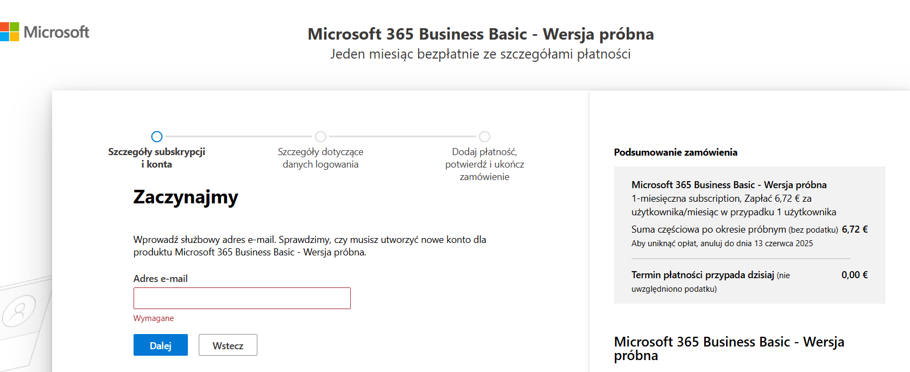
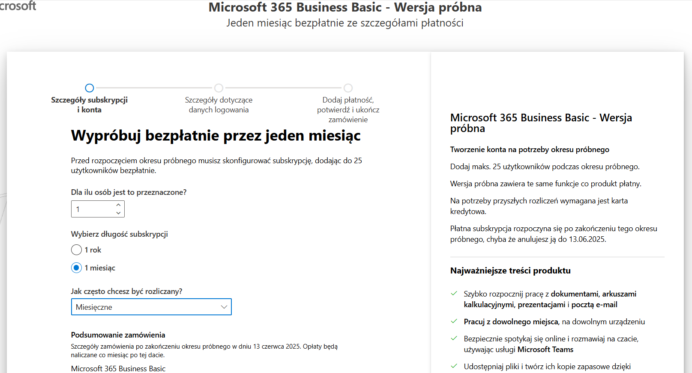

# Budowa LABa Microsoft Defender for Endpoint (licencja P2 z O365 Business Basic)

## Wstęp

Chcesz stworzyć własne środowisko do **Advanced Threat Hunting** i **Detection Engineering**? Ten poradnik poprowadzi Cię krok po kroku!

W ramach projektu stworzyłem własny tenant O365 oparty o licencje (Business Basic + Microsoft Defender for Endpoint P2). Oto szczegółowy opis łącznie z napotkanymi problemami i ich rozwiązaniem.

## Spis treści
- [Wstęp](#wstęp)
- [Etap 1: Rejestracja licencji O365 Business Basic](#etap-1-rejestracja-licencji-o365-business-basic)
- [Etap 2: Rejestracja adresu e-mail](#etap-2-rejestracja-adresu-e-mail)
- [Etap 3: Przydzielenie licencji](#etap-3-przydzielenie-licencji)
- [Etap 4: Oczekiwanie na propagację - cierpliwość to klucz](#etap-4-oczekiwanie-na-propagację---cierpliwość-to-klucz)
- [Etap 5: Konfiguracja w Security.microsoft.com](#etap-5-konfiguracja-w-securitymicrosoftcom)
- [Etap 6: Onboarding maszyny Windows 11](#etap-6-onboarding-maszyny-windows-11)
- [Etap 7: Pierwsze alerty i hunting](#etap-7-pierwsze-alerty-i-hunting)
- [Podsumowanie](#podsumowanie)
- [Co dalej?](#co-dalej)

# Etap 1: Rejestracja licencji O365 Business Basic

- 

## Uwaga: Wybór modelu licencyjnego

W trakcie tworzenia labu mamy różne możliwości modelu licencyjnego.

- Najmniej kosztowna opcja: **Microsoft 365 Business Basic** + **Microsoft Defender for Endpoint P2**.
- Licencja **Business Basic** jest dostępna **za darmo przez pierwszy miesiąc** w ramach okresu próbnego.
- Licencja **Defender for Endpoint P2** kosztuje około **30 zł miesięcznie**.

 Po zakończeniu 30-dniowego okresu demo, **całkowity koszt utrzymania labu wynosi około 60 zł miesięcznie** (Business Basic + P2).

### Ciekawostka: Alternatywne możliwości zdobycia licencji

- W przeszłości istniały alternatywne metody pozyskania licencji Defender for Endpoint P2 za darmo na **90 dni**, np. poprzez program **Microsoft 365 Developer Program**.
- Jednak obecnie **trudniej jest zakwalifikować się do programu Developer**, aby otrzymać darmowe licencje E5 (w tym Defendera P2) — Microsoft zaostrzył kryteria przydziału.
- Alternatywnie osoby posiadające aktywne subskrypcje **Visual Studio (MSDN)** nadal mogą mieć dostęp do pełnych licencji E5 w ramach swoich benefitów.

Mimo to **najprostszym i najszybszym sposobem** na zbudowanie labu jest bezpośredni **zakup licencji P2** w modelu miesięcznym i taka też droga została tutaj opisana.

---

- Wybranie wersji "Wypróbuj bezpłatnie przez miesiąc".

Napotkany problem: komunikat o przeciążonych serwerach (wyświetlany w nieskończoność).  
Rejestracja powiodła się dopiero po przejściu do **trybu incognito** w przeglądarce!

- 

# Etap 2: Rejestracja adresu e-mail

- 
- 

Po wyborze odpowiedniej licencji Business Basic i przejściu przez wstępne ekrany, system Microsoft poprosi o podanie danych rejestracyjnych dla nowego konta organizacyjnego.

**Typowe kroki rejestracji:**
1. Podanie **adresu e-mail**, który będzie używany do logowania do usług Microsoft 365.
2. Wypełnienie podstawowych informacji o organizacji (nazwa organizacji, kraj, numer telefonu kontaktowego).
3. Wybór **domeny organizacji** (np. `twojefirma.onmicrosoft.com`), którą utworzy dla Ciebie Microsoft.
4. Ustawienie danych logowania: **nazwa użytkownika** oraz **hasło**.
5. Potwierdzenie warunków korzystania z usług.

> **Uwaga:** W moim przypadku proces był szybki, natomiast jeżeli używasz adresu e-mail, który już był kiedyś powiązany z Microsoftem, mogą pojawić się dodatkowe kroki weryfikacyjne.

Po pomyślnej rejestracji, otrzymujesz dostęp do pełnego panelu administratora Microsoft 365, gdzie przypisujesz licencje oraz konfigurujesz kolejne ustawienia potrzebne do budowy labu.

---

# Etap 3: Przydzielenie licencji

Po poprawnym założeniu konta organizacyjnego i przypisaniu podstawowej licencji Business Basic, konieczne było uzyskanie dostępu do licencji **Microsoft Defender for Endpoint P2**.

**Zakup licencji Microsoft Defender for Endpoint P2:**

Jeżeli Twoja organizacja nie ma jeszcze przypisanej licencji Defender P2, możesz ją wyszukać i zakupić manualnie:

1. Przejdź do **Microsoft 365 Admin Center** ➔ **Marketplace**,
2. Wyszukaj frazę **"P2"** w polu wyszukiwania,
3. Znajdź produkt **Microsoft Defender for Endpoint P2** i kliknij **Buy now**.

- 

> **Uwaga:** Licencja Defender for Endpoint P2 pojawia się w niektórych przypadkach automatycznie, ale czasami wymaga ręcznego wyszukania. Wyszukanie P2 może być możliwe dopiero po pełnej propagacji danych w organizacji (czasem do kilku godzin od rejestracji).

---

**Przypisanie licencji użytkownikowi:**

Po zakupie licencji P2 należy ją ręcznie przypisać do użytkownika:

1. Wejdź w **Users** ➔ **Active users**,
2. Wybierz użytkownika (Twoje konto),
3. Edytuj licencje ➔ przypisz licencję **Microsoft Defender for Endpoint P2**.

- 
- 

Po poprawnym przypisaniu użytkownik będzie widoczny jako właściciel aktywnej licencji umożliwiającej korzystanie z pełnej funkcjonalności Microsoft Defender for Endpoint.

# Etap 4: Oczekiwanie na propagację - cierpliwość to klucz

- 
- 

Pełna aktywacja usług w portalu **security.microsoft.com** trwała ok. **10-12 godzin**.  
Po drodze pojawiały się błędy jak AxiosError 400 i komunikaty o przygotowywaniu danych.

# Etap 5: Konfiguracja w Security.microsoft.com

- 

Po kilku godzinach:
- Pełny dostęp do **Endpoints**,
- **Advanced Hunting** działa poprawnie,
- Możliwość onboardowania maszyn.

# Etap 6: Onboarding maszyny Windows 11

- 
- 

1. Pobranie skryptu `.cmd`.
2. Uruchomienie na maszynie **Win11-Client**.
3. Maszyna pojawiła się w **Device Inventory**.

> **Tip:** Defender identyfikuje maszynę po DeviceId, nie po adresie IP.

- 

# Etap 7: Pierwsze alerty i hunting

- 
- 

Pierwsze testy:
- Wygenerowanie alertu "Suspicious Powershell CommandLine",
- Dane trafiają poprawnie do **Advanced Hunting**: DeviceProcessEvents, AlertInfo, AlertEvidence itd.

# Podsumowanie

| Krok | Czas | Uwagi |
|:---|:---|:---|
| Rejestracja Business Basic | ~30 min (z problemami) | Przejście przez incognito |
| Zakup Defender P2 i przypisanie | ~10 min | Ręczne przypisanie licencji |
| Propagacja w Defender Portal | ~10-12h | Wymagana cierpliwość |
| Onboarding Windows 11 | ~15 min | Skrypt jako Admin |
| Pierwszy alert / hunting | natychmiast | Pełna widoczność |

# Co dalej?

Planowane kolejne kroki:
- Włączenie reguł ASR (Attack Surface Reduction),
- Symulacje BYOVD (wgrywanie podatnych sterowników),
- Budowa własnych custom detection rules.

---

**Autor:** Krzysztof Krzymowski  
**Status:** Detection Engineer in Progress

Jeśli doceniasz tę pracę i chcesz wesprzeć rozwój labu, już niedługo uruchamiam **Buy Me a Coffee!**

Stay tuned for future updates and simulations! 
