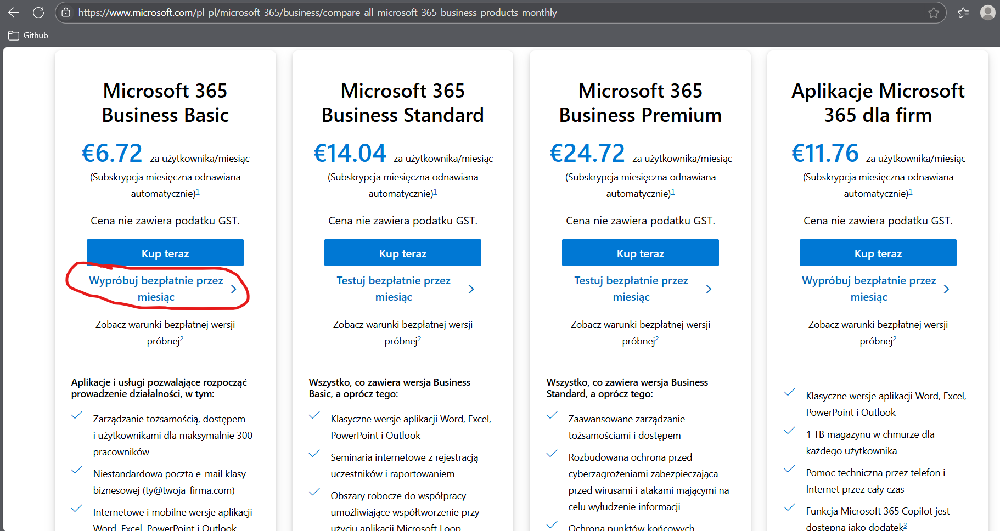
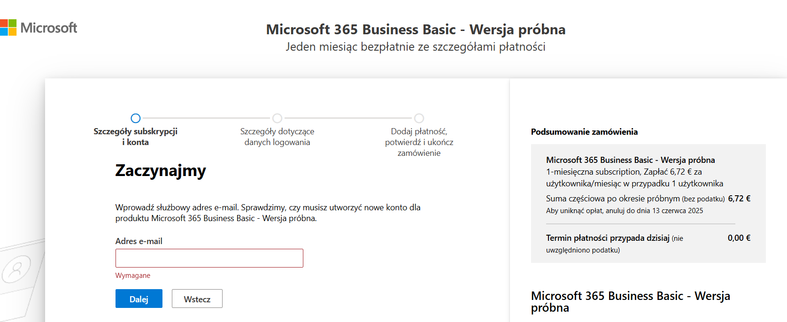
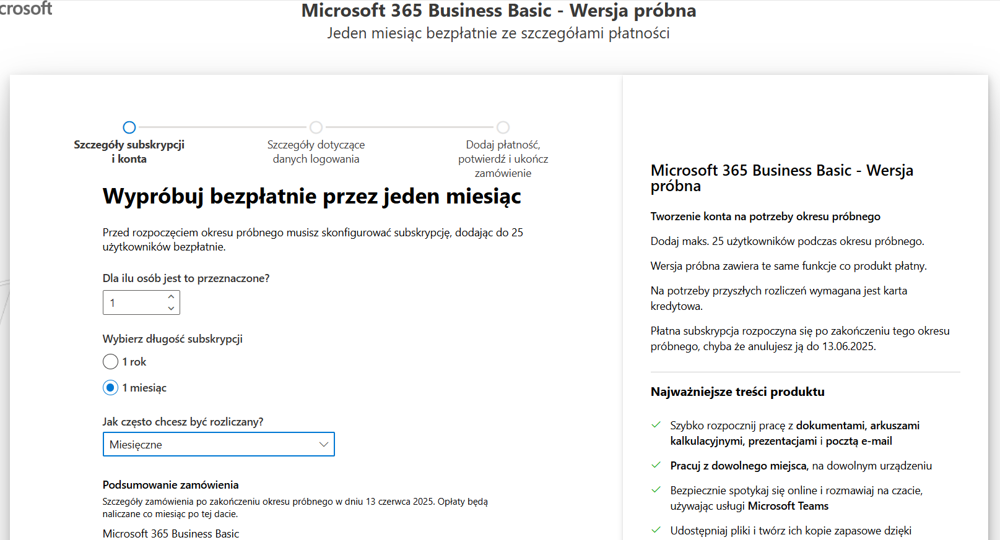
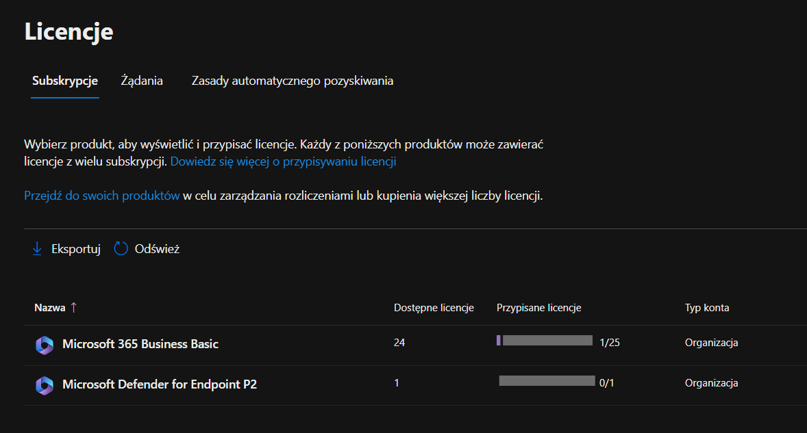
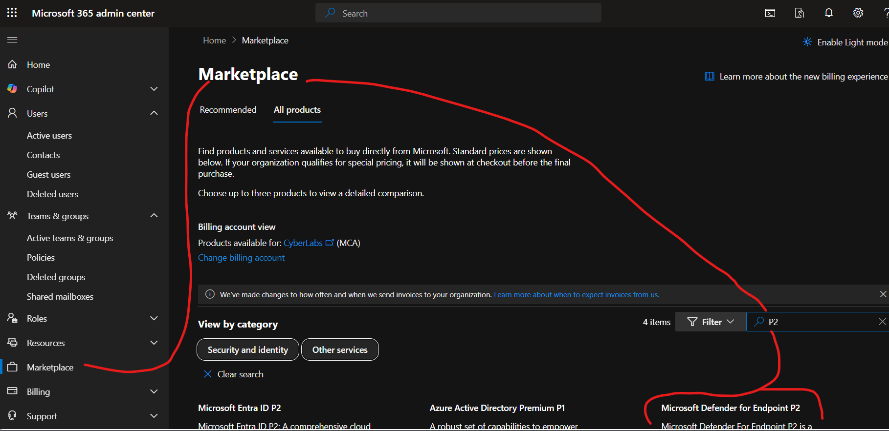
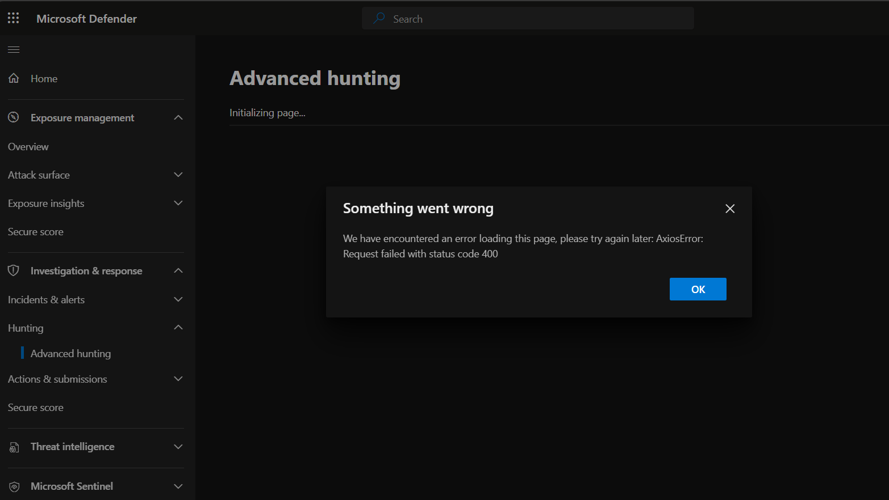
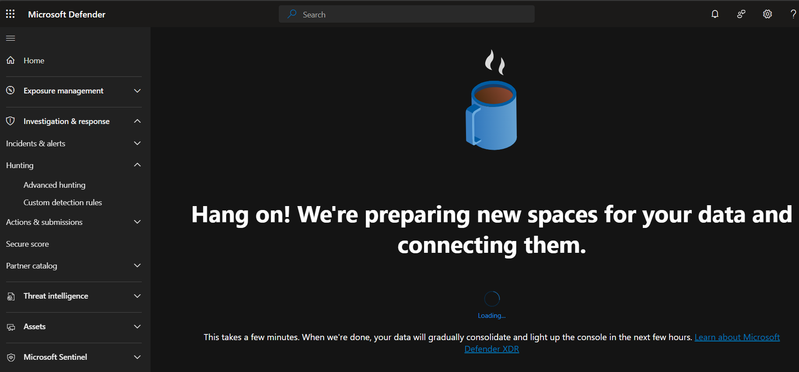
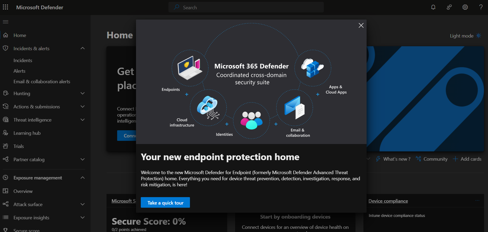
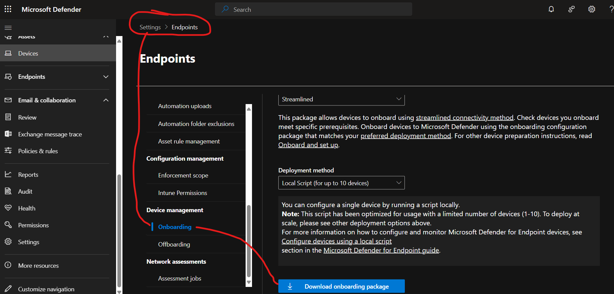
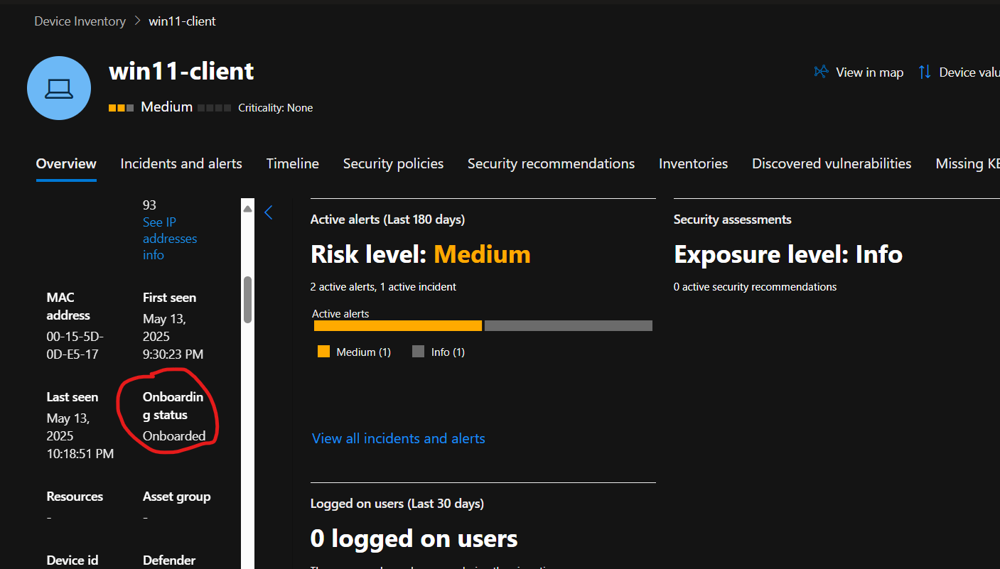

[Przeczytaj tę dokumentację po polsku (README.md)](README.md)

# Building a Microsoft Defender for Endpoint P2 Lab with O365 Business Basic

## Introduction

Are you looking to build your own **Advanced Threat Hunting** and **Detection Engineering** environment?  
This guide walks you through the process step-by-step!

In this project, I created a dedicated Microsoft 365 tenant with **Business Basic** + **Microsoft Defender for Endpoint P2**.  
Here’s a detailed breakdown of the setup, including real-world problems encountered and solutions.

---

## Table of Contents

- [Introduction](#introduction)
- [Step 1: Licensing and Registration](#step-1-licensing-and-registration)
- [Step 2: Creating the Organization Account](#step-2-creating-the-organization-account)
- [Step 3: Assigning Licenses](#step-3-assigning-licenses)
- [Step 4: Waiting for Portal Propagation](#step-4-waiting-for-portal-propagation)
- [Step 5: Portal Configuration](#step-5-portal-configuration)
- [Step 6: Onboarding Windows 11 Device](#step-6-onboarding-windows-11-device)
- [Step 7: First Alerts and Advanced Hunting](#step-7-first-alerts-and-advanced-hunting)
- [Summary](#summary)
- [What’s Next?](#whats-next)
- [Official Documentation and Additional Resources](#official-documentation-and-additional-resources)

---

# Step 1: Licensing and Registration

- 

[Start your free 30-day Microsoft 365 Business Basic trial here](https://www.microsoft.com/en-us/microsoft-365/business/microsoft-365-business-basic)

## Licensing Model Notes:

There are several licensing options available when setting up a Microsoft Defender for Endpoint lab.

- The most cost-effective method is **Microsoft 365 Business Basic** + **Microsoft Defender for Endpoint P2**.
- **Business Basic** can be used **free for the first 30 days** as part of a trial.
- **Defender for Endpoint P2** costs approximately **30 PLN (~7 USD) per month**.

 After the 30-day free period, maintaining the lab will cost around **60 PLN (~14 USD) per month** in total.

### Alternative Licensing Paths:

- Previously, it was possible to obtain Defender P2 through the **Microsoft 365 Developer Program** (90-day free E5 license),  
  but Microsoft has tightened eligibility, making it harder to qualify.
- Developers with an active **Visual Studio (MSDN)** subscription may still access an E5 license, including Defender P2.

 Nevertheless, the simplest and fastest way remains purchasing the **P2 add-on license**.

---

# Step 2: Creating the Organization Account

- 
- 

After selecting the Business Basic license, Microsoft will prompt you to create a new organization account.

**Typical registration steps:**

1. Provide a **working email address** (this becomes your primary login).
2. Fill in the **organization details** (organization name, country, phone number).
3. Choose an **organization domain** (e.g., `yourcompany.onmicrosoft.com`).
4. Set up your **username** and **password**.
5. Accept the service terms.

> **Tip:** If you experience problems during registration (e.g., server overload errors), switching to **Incognito Mode** in your browser often resolves the issue.

---

# Step 3: Assigning Licenses

- 
- 

## Purchasing the Defender for Endpoint P2 license:

If your organization does not yet have the Defender P2 license:

1. Go to **Microsoft 365 Admin Center ➔ Marketplace**,
2. Search for **"P2"**,
3. Locate **Microsoft Defender for Endpoint P2** and click **Buy now**.

- 

## Assigning the licenses:

1. Go to **Users ➔ Active users**.
2. Select your user account.
3. Under **Licenses and Apps**, assign:
   - Microsoft 365 Business Basic,
   - Microsoft Defender for Endpoint P2.

---

# Step 4: Waiting for Portal Propagation

After assigning the licenses, it may take several hours for the Defender portal to fully activate.

**You should monitor two portals:**

- Microsoft 365 Admin Center ➔ [https://admin.microsoft.com](https://admin.microsoft.com)
- Microsoft 365 Security Center ➔ [https://security.microsoft.com](https://security.microsoft.com)

**Common issues during propagation:**
- "Hang on! We're preparing new spaces for your data" messages,
- AxiosError 400 on loading some portal sections,
- Missing tabs like "Endpoints", "Advanced Hunting", "Threat Intelligence".

- 
- 
- 

> **Patience is key:** Full functionality may take up to 10–12 hours after license assignment.

---

# Step 5: Portal Configuration

Once portal propagation is complete:

- Access to **Endpoints** becomes available,
- **Advanced Hunting** queries are enabled,
- Device onboarding can begin.

---

# Step 6: Onboarding Windows 11 Device

For the lab, I used **Hyper-V** with a virtual machine running **Windows 11 Pro**.

## Preparing Windows:

If you need a Windows ISO:

- [Download Windows 10 Media Creation Tool](https://www.microsoft.com/software-download/windows10)
- [Download Windows 11 Media Creation Tool](https://www.microsoft.com/software-download/windows11)

> **Note:** Use Windows Pro, Enterprise, or Education editions to enable full Defender for Endpoint features.

## Minimum machine requirements:

- Windows 10/11 Pro, Enterprise, or Education,
- 2 CPUs, 4 GB RAM, 60+ GB disk,
- Internet access.

## Onboarding steps:

1. Go to ➔ **https://security.microsoft.com ➔ Settings ➔ Endpoints ➔ Device Management ➔ Onboarding**,
2. Select **Local Script (up to 10 devices)**,
3. Download the onboarding package,
4. Extract and run the `.cmd` script **as Administrator**.

- 

After running the script:

- The device appears in **Devices ➔ Inventory** within a few minutes,
- Status should show **Onboarded**.

- 

---

# Step 7: First Alerts and Advanced Hunting

## Test alert:

I generated a test detection on the onboarded Windows 11 machine using a PowerShell command to simulate suspicious behavior:

```powershell
powershell.exe -NoExit -ExecutionPolicy Bypass -WindowStyle Hidden $ErrorActionPreference='silentlycontinue'; (New-Object System.Net.WebClient).DownloadFile('http://127.0.0.1/1.exe', 'C:\\test-WDATP-test\\invoice.exe'); Start-Process 'C:\\test-WDATP-test\\invoice.exe'
```

# Summary

| Step | Estimated Time | Notes |
|:---|:---|:---|
| Licensing | ~30 minutes (some issues encountered) | Registration succeeded after switching to Incognito mode |
| License Assignment | ~10 minutes | Manual assignment of Defender for Endpoint P2 license |
| Portal Propagation | ~10–12 hours | Full Defender portal availability required patience |
| Device Onboarding | ~15 minutes | Local script used for onboarding Windows 11 VM |
| First Detection and Hunting | Immediate after test execution | Telemetry ingestion confirmed |

---

# What’s Next?

The lab is successfully operational!  
The next steps in the roadmap include:

- Enabling and testing **Attack Surface Reduction (ASR) rules**,
- Simulating **BYOVD attacks** (Bring Your Own Vulnerable Driver),
- Building **custom detection rules** in Advanced Hunting,
- Expanding the environment with **Active Directory** + **lateral movement simulations**.

Stay tuned for future updates
---

# Official Documentation and Additional Resources

For more detailed information, check the official Microsoft documentation:

- [Microsoft Defender for Endpoint Overview](https://learn.microsoft.com/en-us/microsoft-365/security/defender-endpoint/microsoft-defender-endpoint?view=o365-worldwide)
- [Onboard Devices to Microsoft Defender for Endpoint](https://learn.microsoft.com/en-us/microsoft-365/security/defender-endpoint/onboard-configure?view=o365-worldwide)
- [Advanced Hunting in Microsoft Defender](https://learn.microsoft.com/en-us/microsoft-365/security/defender/advanced-hunting-overview?view=o365-worldwide)
- [Microsoft 365 Defender Learning Hub](https://learn.microsoft.com/en-us/training/modules/intro-to-microsoft-365-defender/)

---
---

**Author:** Krzysztof Krzymowski  
**Status:** Detection Engineer in Progress

If you found this project helpful and would like to support the creation of more labs and learning content,  
I’ll soon be launching a **Buy Me a Coffee** page

Stay tuned for updates and new simulations!
