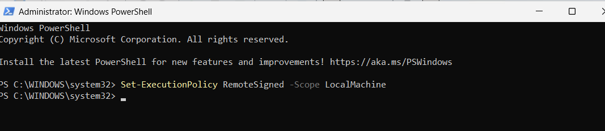
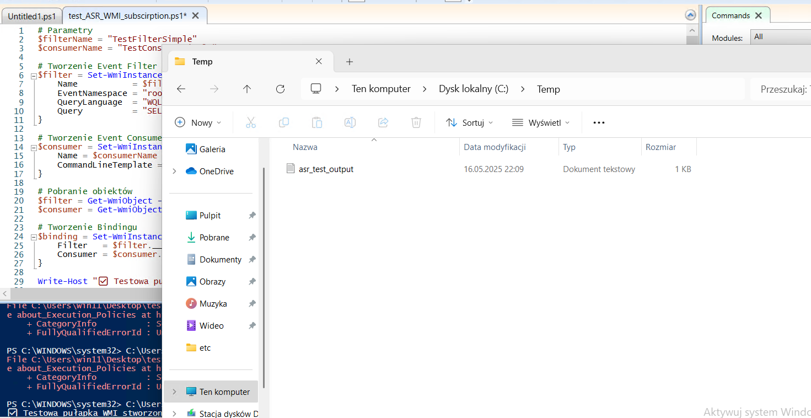
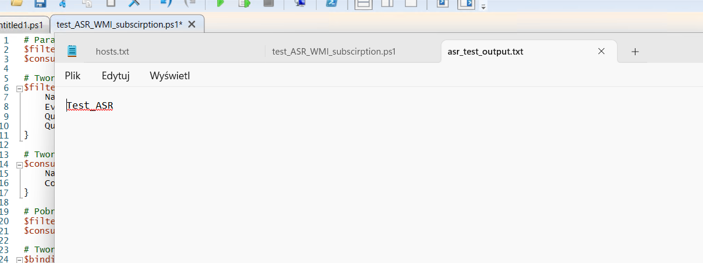
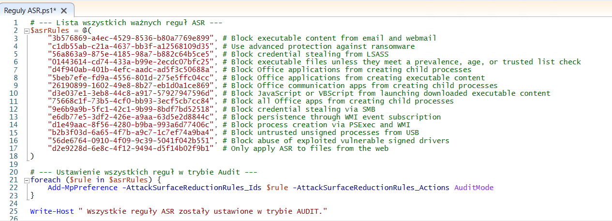
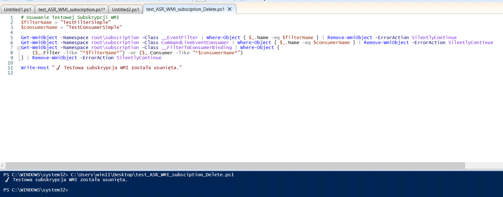

# Testowanie reguł ASR z wykorzystaniem WMI Event Subscription

## Cel
Test ma na celu sprawdzenie skuteczności reguł ASR (Attack Surface Reduction) w kontekście wykrywania trwałych subskrypcji WMI tworzonych przez PowerShell. Tego typu subskrypcje są znaną techniką persistence, wykorzystywaną przez zaawansowanych przeciwników do utrzymania dostępu w systemie bez ingerencji w typowe mechanizmy autostartu.

##  Spis treści
- [1. Problem z uruchomieniem skryptu `.ps1`](#1-problem-z-uruchomieniem-skryptu-ps1)
- [2. Zmiana ExecutionPolicy (tylko na czas testu)](#2-zmiana-executionpolicy-tylko-na-czas-testu)
- [3. Poprawne wykonanie skryptu WMI Subscription](#3-poprawne-wykonanie-skryptu-wmi-subscription)
- [4. Wygenerowanie pliku testowego](#4-wygenerowanie-pliku-testowego)
- [5. Query do wykrywania reguł ASR](#5-query-do-wykrywania-reguł-asr)
- [6. Szczegóły zdarzenia ProcessCommandLine](#6-szczegóły-zdarzenia-processcommandline)
- [7. Uruchomienie reguł ASR w trybie audytu](#7-uruchomienie-reguł-asr-w-trybie-audytu)
- [8. Usunięcie subskrypcji po teście](#8-usunięcie-subskrypcji-po-teście)

##  Kroki testowe

### 1. Problem z uruchomieniem skryptu `.ps1`
  
Podczas pierwszego uruchomienia testowego skryptu PowerShell pojawił się błąd wynikający z domyślnej polityki bezpieczeństwa systemu Windows. `ExecutionPolicy` na wielu systemach ustawiona jest domyślnie na `Restricted`, co uniemożliwia wykonanie nawet lokalnych skryptów `.ps1`. Jest to mechanizm zabezpieczający przed automatycznym uruchomieniem złośliwego kodu.

### 2. Zmiana ExecutionPolicy (tylko na czas testu)
  
Aby umożliwić test, wykonano jednorazową zmianę polityki wykonania tylko dla bieżącej sesji PowerShell, bez trwałej zmiany ustawień systemowych. Dzięki temu mogliśmy uruchomić skrypt z subskrypcją WMI bez ryzyka złamania zasad organizacyjnych lub wpływu na system globalnie.
```powershell
Set-ExecutionPolicy -Scope Process -ExecutionPolicy Bypass -Force
```

### 3. Poprawne wykonanie skryptu WMI Subscription
  
Skrypt tworzy filtr zdarzeń WMI, który monitoruje zmiany w klasie `Win32_LocalTime`, a następnie rejestruje konsumenta, który wykonuje polecenie `cmd.exe` przy każdym takim zdarzeniu. Całość wiązana jest przez `__FilterToConsumerBinding`, tworząc pełną subskrypcję WMI. Tego typu mechanizmy są często wykorzystywane przez malware jako technika persistence.

### 4. Wygenerowanie pliku testowego
  
Po wymuszeniu zmiany czasu systemowego subskrypcja WMI została aktywowana i polecenie `cmd.exe /c echo Test_ASR` wygenerowało plik `C:\Temp\asr_test_output.txt`. Ten plik stanowi artefakt potwierdzający, że subskrypcja zadziałała poprawnie – pełni rolę sygnatury działania mechanizmu persistence.

### 5. Query do wykrywania reguł ASR
  
W Defender for Endpoint można wykorzystać zapytania KQL, aby odnaleźć podejrzane działania związane z tworzeniem subskrypcji lub innymi technikami persistence. W tym przypadku filtrujemy `DeviceEvents`, szukając ciągów zawierających `Wmi` lub uruchomienia `powershell.exe` – narzędzia często używanego do tworzenia takich subskrypcji.
```kql
DeviceEvents
| where ActionType contains "Wmi" or InitiatingProcessFileName =~ "powershell.exe"
```

### 6. Szczegóły zdarzenia ProcessCommandLine
  
Widoczne szczegóły komendy (`cmd.exe /c echo Test_ASR`) oraz procesów nadrzędnych (`WmiPrvSE.exe`) pozwalają jednoznacznie zidentyfikować źródło wykonania komendy. Takie informacje są kluczowe podczas analizy incydentu i potwierdzania wykorzystania techniki persistence w postaci WMI Event Consumer.

### 7. Uruchomienie reguł ASR w trybie audytu
  
Przed rozpoczęciem testu wszystkie istotne reguły ASR zostały włączone w trybie audytowym, co pozwala na ich monitorowanie bez ingerencji w działanie systemu. Wartość `AuditMode` umożliwia obserwowanie potencjalnych incydentów bez ich blokowania – idealne do środowisk testowych i walidacyjnych.
```powershell
Add-MpPreference -AttackSurfaceReductionRules_Ids 75668C1F-73B5-4CF0-BB93-3ECF5CB7CC84 -AttackSurfaceReductionRules_Actions AuditMode
```

### 8. Usunięcie subskrypcji po teście
  
Po zakończeniu testów dobrą praktyką jest przywrócenie systemu do stanu wyjściowego. Usunięcie filtrów, konsumentów i powiązań eliminuje ryzyko niezamierzonych wywołań w przyszłości i zapewnia spójność środowiska labowego lub produkcyjnego.

---

##  Skrypt testowy
Plik: `test_wmi_subscription.ps1`
```powershell
$filterName = "TestFilterSimple"
$consumerName = "TestConsumerSimple"

$filter = Set-WmiInstance -Namespace root\subscription -Class __EventFilter -Arguments @{
    Name           = $filterName
    EventNamespace = "root\\cimv2"
    QueryLanguage  = "WQL"
    Query          = "SELECT * FROM __InstanceModificationEvent WITHIN 60 WHERE TargetInstance ISA 'Win32_LocalTime'"
}

$consumer = Set-WmiInstance -Namespace root\subscription -Class CommandLineEventConsumer -Arguments @{
    Name = $consumerName
    CommandLineTemplate = "cmd.exe /c echo Test_ASR > C:\\Temp\\asr_test_output.txt"
}

$filter = Get-WmiObject -Namespace root\subscription -Class __EventFilter | Where-Object { $_.Name -eq $filterName }
$consumer = Get-WmiObject -Namespace root\subscription -Class CommandLineEventConsumer | Where-Object { $_.Name -eq $consumerName }

$binding = Set-WmiInstance -Namespace root\subscription -Class __FilterToConsumerBinding -Arguments @{
    Filter   = $filter.__PATH
    Consumer = $consumer.__PATH
}
```

##  Cleanup skrypt (opcjonalny)
```powershell
Get-WmiObject -Namespace root\subscription -Class __FilterToConsumerBinding | Where-Object { $_.Filter -like "*TestFilterSimple*" } | Remove-WmiObject
Get-WmiObject -Namespace root\subscription -Class CommandLineEventConsumer | Where-Object { $_.Name -eq "TestConsumerSimple" } | Remove-WmiObject
Get-WmiObject -Namespace root\subscription -Class __EventFilter | Where-Object { $_.Name -eq "TestFilterSimple" } | Remove-WmiObject
```

---

**Autor:** Krzysztof Krzymowski  
**Repozytorium:** `defender-lab-setup/asr-wmi-test/`

> Test pokazuje, że nawet prosty mechanizm persistence jak WMI Subscriptions może zostać wykryty przez Defender for Endpoint przy odpowiednich ustawieniach ASR + audytu.
````
