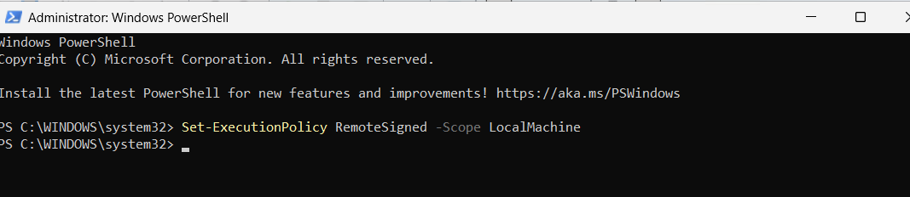
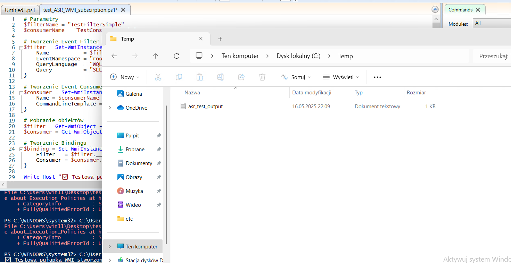
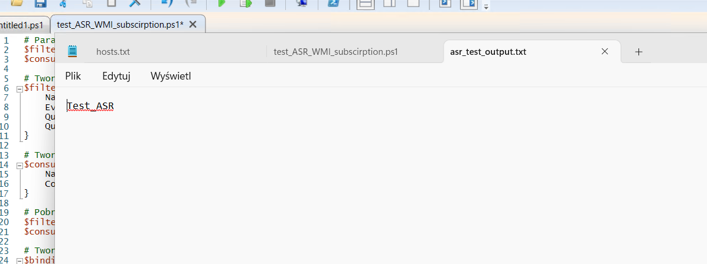
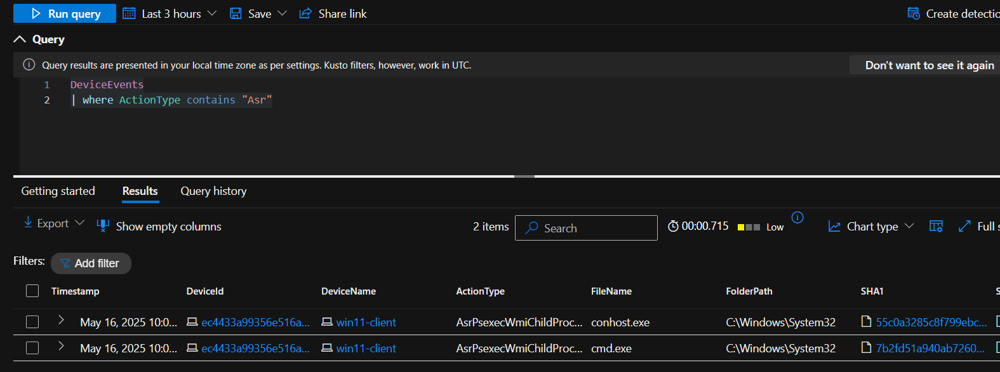
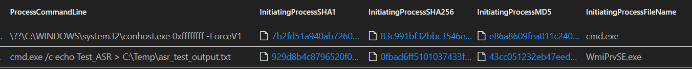
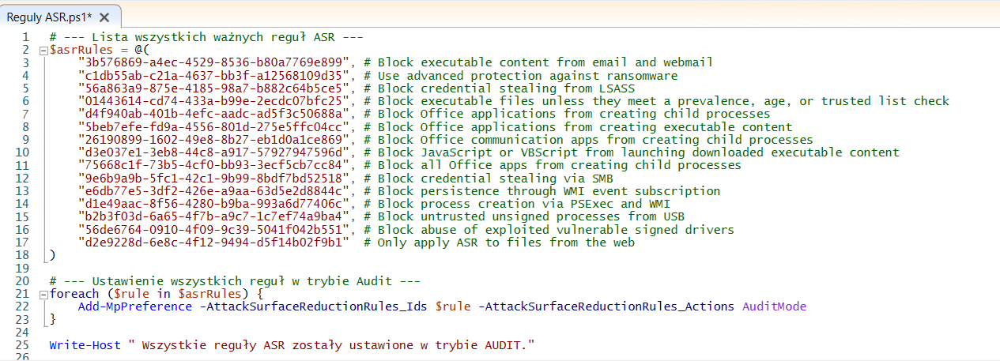
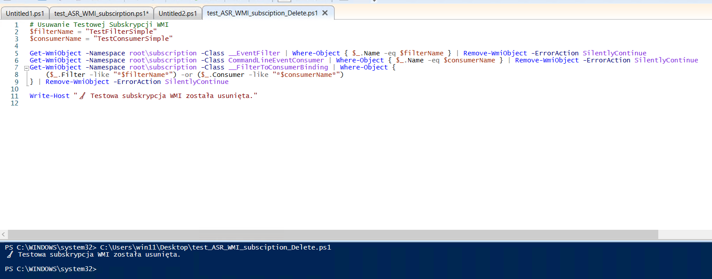

# Testowanie reguł ASR z wykorzystaniem WMI Event Subscription

##  Cel
Test ma na celu sprawdzenie skuteczności reguł ASR (Attack Surface Reduction) w kontekście wykrywania trwałych subskrypcji WMI tworzonych przez PowerShell. Takie techniki są często wykorzystywane przez malware do utrzymania trwałości (persistence).

##  Struktura repozytorium
```
/defender-lab-setup/
├── screenshots/
│   └── ASR-WMI-test/
│       ├── 001_blad_uruchomienia_skryptu.png
│       ├── 002_zmiana_execution_policy.png
│       ├── 003_subskrypcja_WMI_dziala.png
│       ├── 004_plik_ASR_wygenerowany.png
│       ├── 005_query_do_wyszukiwania_ASR.png
│       ├── 006_processcommandline_szczegoly.png
│       ├── 007_uruchomienie_regul_ASR_audit.png
│       ├── 008_usuniecie_subskrypcji_WMI.png
│
├── asr-wmi-test/
│   └── test_wmi_subscription.ps1
```

## Spis treści
- [1. Problem z uruchomieniem skryptu `.ps1`](#1-problem-z-uruchomieniem-skryptu-ps1)
- [2. Zmiana ExecutionPolicy (tylko na czas testu)](#2-zmiana-executionpolicy-tylko-na-czas-testu)
- [3. Poprawne wykonanie skryptu WMI Subscription](#3-poprawne-wykonanie-skryptu-wmi-subscription)
- [4. Wygenerowanie pliku testowego](#4-wygenerowanie-pliku-testowego)
- [5. Query do wykrywania reguł ASR](#5-query-do-wykrywania-reguł-asr)
- [6. Szczegóły zdarzenia ProcessCommandLine](#6-szczegóły-zdarzenia-processcommandline)
- [7. Uruchomienie reguł ASR w trybie audytu](#7-uruchomienie-reguł-asr-w-trybie-audytu)
- [8. Usunięcie subskrypcji po teście](#8-usunięcie-subskrypcji-po-teście)

##  Kroki testowe

### 1. Problem z uruchomieniem skryptu `.ps1`
  
System blokuje uruchamianie skryptów PowerShell z powodu polityki `ExecutionPolicy`.

### 2. Zmiana ExecutionPolicy (tylko na czas testu)
  
Rozwiązanie problemu przez ustawienie:
```powershell
Set-ExecutionPolicy -Scope Process -ExecutionPolicy Bypass -Force
```

### 3. Poprawne wykonanie skryptu WMI Subscription
  
Subskrypcja zostaje założona i nasłuchuje na zmiany w klasie `Win32_LocalTime`.

### 4. Wygenerowanie pliku testowego
  
Zmiana czasu systemowego wyzwala zdarzenie, które tworzy plik `C:\Temp\asr_test_output.txt`.

### 5. Query do wykrywania reguł ASR
  
Przykładowe zapytanie w Defender:
```kql
DeviceEvents
| where ActionType contains "Wmi" or InitiatingProcessFileName =~ "powershell.exe"
```

### 6. Szczegóły zdarzenia ProcessCommandLine
  
Pełna ścieżka procesu i dane pozwalające zidentyfikować technikę persistence.

### 7. Uruchomienie reguł ASR w trybie audytu
  
Skrypt umożliwiający włączenie wszystkich reguł ASR w trybie "Audit":
```powershell
Add-MpPreference -AttackSurfaceReductionRules_Ids 75668C1F-73B5-4CF0-BB93-3ECF5CB7CC84 -AttackSurfaceReductionRules_Actions AuditMode
```

### 8. Usunięcie subskrypcji po teście
  
Subskrypcja, filtr i konsument zostali usunięci w celu czyszczenia środowiska.

---

## Skrypt testowy
Plik: `test_wmi_subscription.ps1`
```powershell
$filterName = "TestFilterSimple"
$consumerName = "TestConsumerSimple"

$filter = Set-WmiInstance -Namespace root\subscription -Class __EventFilter -Arguments @{
    Name           = $filterName
    EventNamespace = "root\\cimv2"
    QueryLanguage  = "WQL"
    Query          = "SELECT * FROM __InstanceModificationEvent WITHIN 60 WHERE TargetInstance ISA 'Win32_LocalTime'"
}

$consumer = Set-WmiInstance -Namespace root\subscription -Class CommandLineEventConsumer -Arguments @{
    Name = $consumerName
    CommandLineTemplate = "cmd.exe /c echo Test_ASR > C:\\Temp\\asr_test_output.txt"
}

$filter = Get-WmiObject -Namespace root\subscription -Class __EventFilter | Where-Object { $_.Name -eq $filterName }
$consumer = Get-WmiObject -Namespace root\subscription -Class CommandLineEventConsumer | Where-Object { $_.Name -eq $consumerName }

$binding = Set-WmiInstance -Namespace root\subscription -Class __FilterToConsumerBinding -Arguments @{
    Filter   = $filter.__PATH
    Consumer = $consumer.__PATH
}
```

## Cleanup skrypt (opcjonalny)
```powershell
Get-WmiObject -Namespace root\subscription -Class __FilterToConsumerBinding | Where-Object { $_.Filter -like "*TestFilterSimple*" } | Remove-WmiObject
Get-WmiObject -Namespace root\subscription -Class CommandLineEventConsumer | Where-Object { $_.Name -eq "TestConsumerSimple" } | Remove-WmiObject
Get-WmiObject -Namespace root\subscription -Class __EventFilter | Where-Object { $_.Name -eq "TestFilterSimple" } | Remove-WmiObject
```

---

**Autor:** Krzysztof Krzymowski  
**Repozytorium:** `defender-lab-setup/asr-wmi-test/`

> Test pokazuje, że nawet prosty mechanizm persistence jak WMI Subscriptions może zostać wykryty przez Defender for Endpoint przy odpowiednich ustawieniach ASR + audytu.
